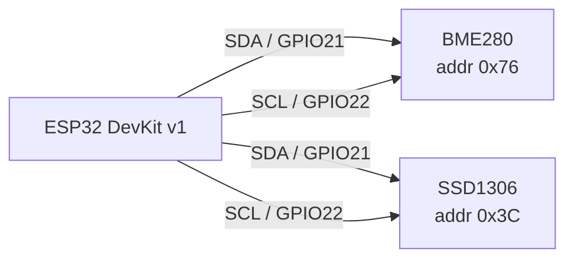

# Montagem

## Ligações

Ambos os periféricos compartilham o mesmo barramento I²C, então os pinos
`SDA` e `SCL` são ligados em paralelo.

| ESP32 | BME280 | OLED SSD1306 |
| --- | --- | --- |
| `3V3` | `VCC` | `VCC` |
| `GND` | `GND` | `GND` |
| `GPIO21` | `SDA` | `SDA` |
| `GPIO22` | `SCL` | `SCL` |

## Diagrama do barramento

## Conferindo antes de energizar

1. Nenhum fio de `3V3` encostando em `GND`.
2. Os dois resistores de pull-up entre `SDA`/`SCL` e `3V3`.
3. O cabo USB conectado só **depois** da conferência acima.

??? tip "O sensor não aparece no barramento?"
    Rode um scanner I²C. Se o endereço detectado for `0x77` em vez de
    `0x76`, o módulo tem o pino `SDO` em nível alto — basta ajustar o
    endereço no código do firmware.
