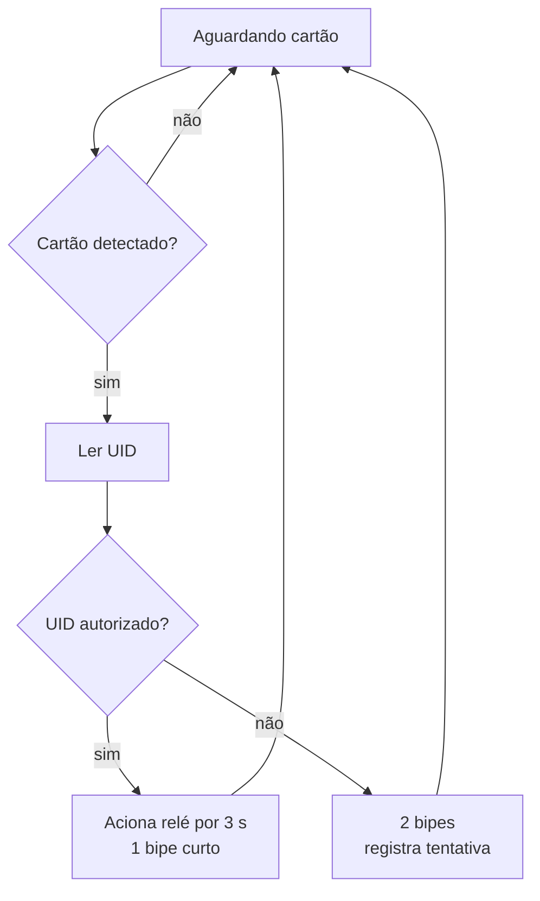

# Montagem

## Ligações do RFID-RC522

O módulo usa SPI, que precisa de mais fios que o I²C do projeto anterior.

| ESP32 | RC522 | Função |
| --- | --- | --- |
| `3V3` | `3.3V` | Alimentação |
| `GND` | `GND` | Referência |
| `GPIO23` | `MOSI` | Dados do mestre para o escravo |
| `GPIO19` | `MISO` | Dados do escravo para o mestre |
| `GPIO18` | `SCK` | Clock |
| `GPIO5` | `SDA` / `SS` | Seleção do dispositivo |
| `GPIO27` | `RST` | Reset |

## Periféricos de saída

| ESP32 | Componente |
| --- | --- |
| `GPIO26` | Entrada `IN` do módulo relé |
| `GPIO25` | Terminal positivo do buzzer |

## Fluxo do sistema

!!! note "Por que `3.3V` e não `5V`?"
    O RC522 aceita 3,3 V apenas. Diferente de outros módulos, ele **não**
    tem regulador embutido.
